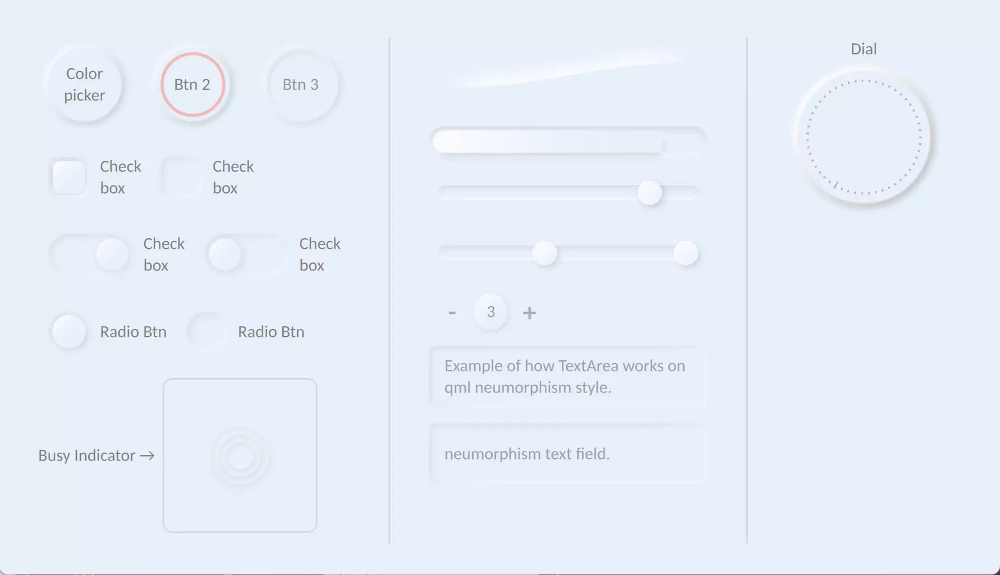
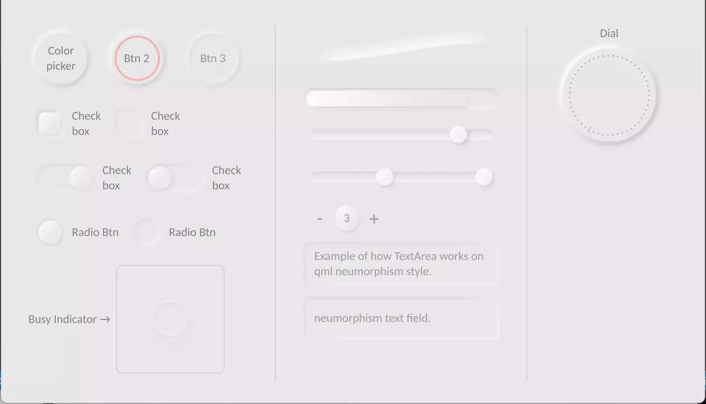

# QML Neumorphism (soft UI) QtQuick style.
<br>

Start developing *Neumorphic QtQuick* applications using Neumorphism UI.<br>
The Neumorphic design concept has been applied to all of the components.

Also I used `ShaderEffect` for drop shadows, so there may be a few computational errors, but it's still better than QML's native drop shadow.

### What is Neumorphism?
[Medium](https://artofofiare.medium.com/neumorphism-the-right-way-a-2020-design-trend-386e6a09040a)
> Neumorphism (or Neo-skeuomorphism) is a modern iteration of a style of designing web elements, frames, screens, etc. known as [Skeuomorphism](https://medium.muz.li/skeuomorphic-design-a-controversial-ux-approach-that-is-making-a-comeback-a0b6e93eb4bb).

## Preview

<center>




</center>

---

## How to use
### Attention!
This component has only been tested on *Qt version 5.15.2* and *Windows OS* at *3840x2160 resolution* with a *scaling factor of 250 percent*; usage of this component carries no ***warranty***.

### Usage
#### **Simple usage**
Components from the `Neumorphism/` directory can be included in your project's resources.
Then, in your qml file, add `import "path/to/resource"` to use them.

#### **Use as a module**
You may also copy the `Neumorphism/` directory to any location and include it in `engine.addImportPath` and `QML_IMPORT_PATH` in your qmake file.<br>
```make
QML_IMPORT_PATH += "C:/Neumorphism/"
```
```cpp
engine.addImportPath("C:/Neumorphism/");
```
```qml
import Neumorphism 1.1
```
Alternatively, copy the `Neumorphism/` directory to the Qt qml component directory.
And import it to your qml file.
```qml
import Neumorphism 1.1
```
---

## Components
<details>
<summary> Available</summary>

- [x] Button
- [x] Radio Button
- [x] CheckBox
- [x] AdvancedRectangle
- [x] Slider
- [x] TextArea
- [x] TextField 
- [x] ProgressBar
- [x] RadioButton
- [x] Switch
- [x] RangeSlider
- [x] SpinBox
- [x] HorizontalSeparator
- [x] Tumbler
- [x] Dial
- [x] BusyIndicator
- [x] SplitView
- [x] StackView

</details>

<details open>
<summary> Pending</summary>

- [ ] Custom styled text

</details>

---

## Issues

Please file an issue on [issues page](https://github.com/SMR76/qml-neumorphism/) if you have any problems.

---

## Documentation
no document provided yet.

---

## Donation
&emsp;  <a href="https://www.blockchain.com/bch/address/bitcoincash:qrnwtxsk79kv6mt2hv8zdxy3phkqpkmcxgjzqktwa3">
        </a>

## License
&emsp;  <a href="https://choosealicense.com/licenses/gpl-3.0/">
        </a>
