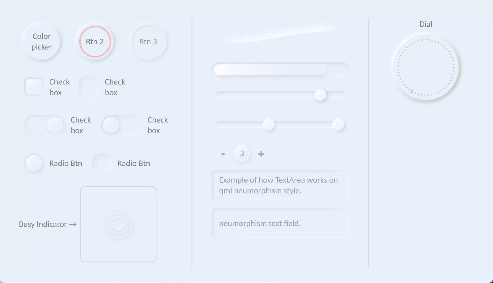
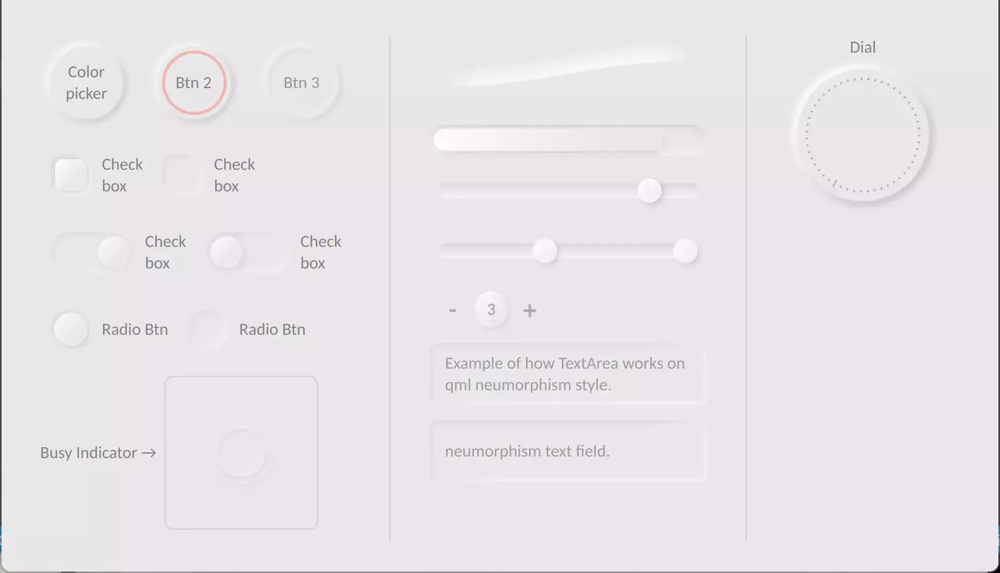

# QML Neumorphism (soft UI) QtQuick style.
<p>

<a href="https://www.blockchain.com/bch/address/bitcoincash:qrnwtxsk79kv6mt2hv8zdxy3phkqpkmcxgjzqktwa3">
</a></p>

Start developing *Neumorphic QtQuick* applications using Neumorphism UI.<br>
The Neumorphic design concept has been applied to all of the components.

Also I used `ShaderEffect` for drop shadows, so there may be a few computational errors, but it's still better than QML's native drop shadow.

### What is Neumorphism?
[Medium](https://artofofiare.medium.com/neumorphism-the-right-way-a-2020-design-trend-386e6a09040a)
> Neumorphism (or Neo-skeuomorphism) is a modern iteration of a style of designing web elements, frames, screens, etc. known as [Skeuomorphism](https://medium.muz.li/skeuomorphic-design-a-controversial-ux-approach-that-is-making-a-comeback-a0b6e93eb4bb).

## Preview

<div align="center">

&ensp;<br>


</div>

## How to use
> **Warning**<br>
> This components hava only been tested on **Qt version 5.15.2** and *Windows OS* at *3840x2160 resolution* with a *scaling factor of 250 percent*; ***USAGE OF THIS COMPONENTS CARRIES NO WARRANTY***.
> <br>&nbsp;

### Usage
Clone the repository first.
```bash
git clone https://github.com/SMR76/qml-neumorphism.git
```
Then include `Neumorphism.pri` in your project. <sub>[see example-1](Example/example-1/example-1.pro#L11)</sub>
```make
include('path/to/Neumorphism.pri')
```
Add `qrc:/` to the engine import path. <sub>[see example-1](Example/example-1/main.cpp#L12)</sub>
```cpp
engine.addImportPath("qrc:/");
```
And finally import the `Neumorphism` module. <sub>[see example-1](Example/example-1/main.qml#L5)</sub>
```qml
import Neumorphism 1.2
```

If you are confused, please refer to [Example-1](Example/example-1/) for a clearer understanding of what you should do.

## Components

- [x] Button
- [x] Radio Button
- [x] CheckBox
- [x] Slider
- [x] TextArea
- [x] TextField
- [x] ProgressBar
- [x] RadioButton
- [x] Switch
- [x] RangeSlider
- [x] SpinBox
- [x] Tumbler
- [x] Dial
- [x] BusyIndicator
- [x] SplitView
- [x] StackView
- [x] ComboBox
---
- [x] HorizontalSeparator
- [x] Custom Neumorphic shape

## Issues

Please file an issue on [issues page](https://github.com/SMR76/qml-neumorphism/) if you have any problems.

## Documentation

no document provided yet.
