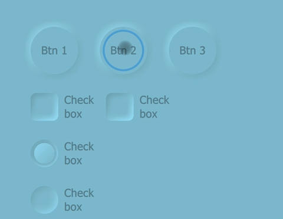
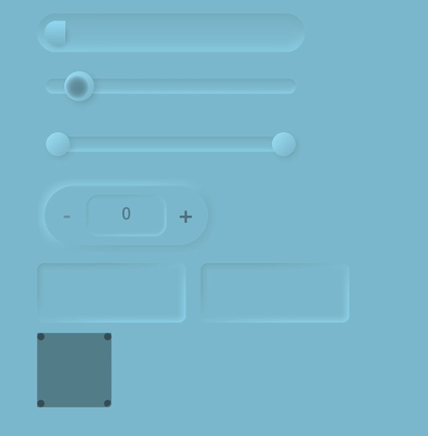
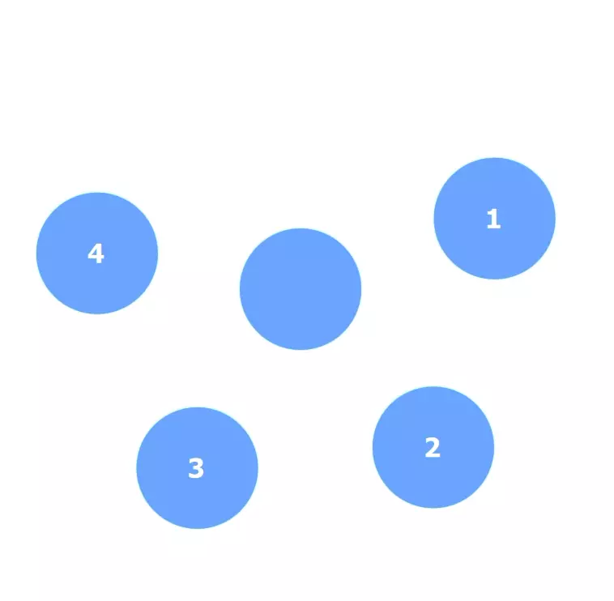

# QML Neumorphism (soft UI) QtQuick style.
 

Start developing *Neumorphic QtQuick* applications using Neumorphism UI. 
All the components are designed according to the Neumorphic design trend.

For drop shadows, I used *ShaderEffect*, so there may be a couple of algorithmic mistakes, but at all, it's better than the *QML* its own drop shadow.

### What is Neumorphism?
[Medium](https://artofofiare.medium.com/neumorphism-the-right-way-a-2020-design-trend-386e6a09040a)
> Neumorphism (or Neo-skeuomorphism) is a modern iteration of a style of designing web elements, frames, screens, etc. known as [Skeuomorphism](https://medium.muz.li/skeuomorphic-design-a-controversial-ux-approach-that-is-making-a-comeback-a0b6e93eb4bb).

## Preview

    
Preview-1 (<i>Components</i>)

    &nbsp;
    

    
Preview-2 (<i>Color changes</i>)

    <video src="Extera/Preview/neumorphism-preview-3.mp4" height="400px" autoplay loop>

    
Preview-3 (<i>Gooey view</i>)

    

---

## Components

 Available

- [x] Button
- [x] Radio Button
- [x] CheckBox
- [x] AdvancedRectangle
- [x] Slider
- [x] TextArea
- [x] TextField 
- [x] ProgressBar
- [x] RadioButton
- [x] Switch
- [x] RangeSlider
- [x] SpinBox
- [x] HorizontalSeparator
- [x] Tumbler
- [x] Dial
- [x] MultiRangeSlider
- [x] GooeyView <small>(beta)</small>

 Pending

- [ ] MultiPointGradient
- [ ] BusyIndicator
- [ ] StackView
- [ ] SwipeView
- [ ] SplitView
- [ ] CircularProgressBar

---

## How to use
no document provided yet.

---

## Documentation
no document provided yet.

---

## 3rd-Parties
&emsp;  

## Donation
&emsp;  

## License
&emsp;  
